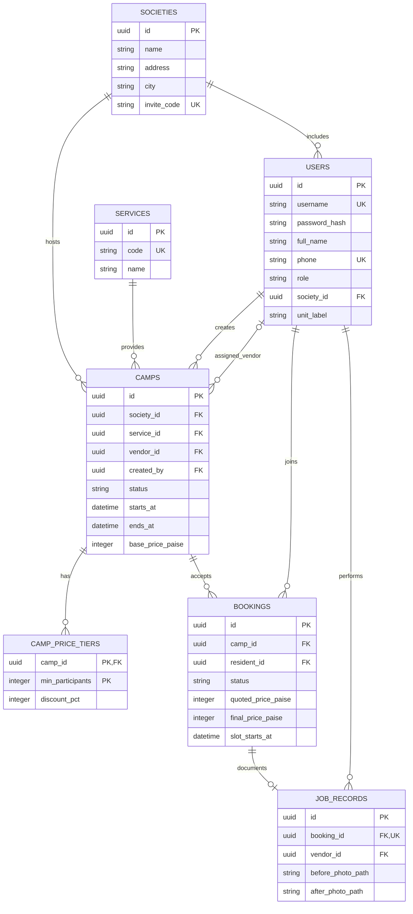

# Domora MVP data model

This ERD records the Phase 1 relational design. It complements the table and constraint details in
[ARCHITECTURE.md](../context/ARCHITECTURE.md).

```mermaid
erDiagram
    SOCIETIES ||--o{ USERS : includes
    SOCIETIES ||--o{ CAMPS : hosts
    SERVICES ||--o{ CAMPS : provides
    USERS ||--o{ CAMPS : creates
    USERS o|--o{ CAMPS : assigned_vendor
    CAMPS ||--o{ CAMP_PRICE_TIERS : has
    CAMPS ||--o{ BOOKINGS : accepts
    USERS ||--o{ BOOKINGS : joins
    BOOKINGS ||--o| JOB_RECORDS : documents
    USERS ||--o{ JOB_RECORDS : performs

    SOCIETIES {
        uuid id PK
        string name
        string address
        string city
        string invite_code UK
    }
    USERS {
        uuid id PK
        string username UK
        string password_hash
        string full_name
        string phone UK
        string role
        uuid society_id FK
        string unit_label
    }
    SERVICES {
        uuid id PK
        string code UK
        string name
    }
    CAMPS {
        uuid id PK
        uuid society_id FK
        uuid service_id FK
        uuid vendor_id FK
        uuid created_by FK
        string status
        datetime starts_at
        datetime ends_at
        integer base_price_paise
    }
    CAMP_PRICE_TIERS {
        uuid camp_id PK, FK
        integer min_participants PK
        integer discount_pct
    }
    BOOKINGS {
        uuid id PK
        uuid camp_id FK
        uuid resident_id FK
        string status
        integer quoted_price_paise
        integer final_price_paise
        datetime slot_starts_at
    }
    JOB_RECORDS {
        uuid id PK
        uuid booking_id FK, UK
        uuid vendor_id FK
        string before_photo_path
        string after_photo_path
    }
```
